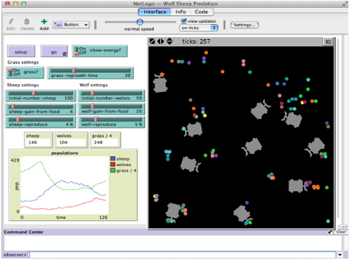
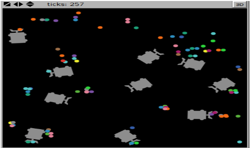
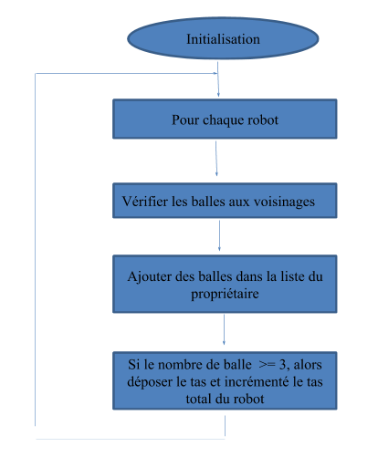

# Robot Ramasseurs De Balles
---

|               Fodé HISSIROU               |
---

## 1. Introduction

#### a. Systèmes multi-agents

systèmes multi-agent sont composés d’entités informatiques distribuées qui interagissent entre elles. 
Il détermine les règles permettant de concevoir des systèmes intelligence artificiel fondé sur des règles. 
Il s’intéresse aux comportements collectifs produits par des interactions de plusieurs entités autonomes et flexibles.
Ces entités peuvent opérer de façons collectives pour accomplir les tâches complexes. 
Malgré que les caractéristiques de modélisation dépendent de l’application, 
mais il y a bien certains caractéristiques qui sont commune aux agents : La coopération, la coordination et la communication.

#### b. Un agent 

C’est une entité autonome, réelle ou abstraite qui est capable d’agir sur elle-même et sur son environnement,
qui, dans un univers multi-agents, peut communiquer avec d’autres agents et dont le comportement est la conséquence de ses observations,
de ses connaissances et des interactions avec d’autres agents. 
Cependant, les agents peuvent être classés en deux catégories principales selon leur comportement et leur complexité de raisonnement afin de séparer les agents dites « intelligents »  des agents moins « intelligents ». 
On parle donc des agents cognitifs et agents réactifs
Concevoir le site Workfoce en tenant compte des aspects

#####  b.1. - Les agents cognitifs
sont fondés sur la coopération d’agents capables à eux  seuls d’effectuer des opérations complexes. 
Un système cognitif comprend un petit nombre d’agents qui disposent d’une capacité de raisonnement sur une base de connaissances 
pour traiter les informations diverses liées au domaine d’applications.
Ces types d’agents peuvent être assimilés à des systèmes experts distribués.

##### b.2. Un agent réactif 

Evolue parmi un nombre important de ses semblables et c’est le résultat des interactions entre leur activité qui donne une impression de comportement global « intelligent ».
Ces agents de ne possèdent de représentations de leur environnement. 
De ce fait toutes les informations relatives à leur comportement se trouvent dans l’environnement et leurs réactions dépendant uniquement de la perception qu’ils peuvent en avoir.

## 2. Présentation de l’outil Netlogo
Un des outils largement utilisé pour la simulation des systèmes multi-agent est le logiciel Netlogo qui est un logiciel open source fourni sous la licence GPL.  
Il est à la fois un langage de programmation et un environnement de modélisation pour le développement des systèmes multi-agents.
De base, il été développé en Java par l’Université Northwestern pour des fins pédagogiques, 
et de nos jours Netlogo est beaucoup utilisé dans le milieu professionnel et cela est dû à la facilité d’utilisation 
qui permet de modéliser des phénomènes sans pour autant avoir des connaissances approfondie en programmation. 
Il particulièrement adapté à la modélisation de systèmes complexes sur un parcours de temps.

## 3. Description du modèle
Dans le cadre du cours de système multi-agents, il nous a été demandé de simuler  des robots ramasseurs de balles. 
La simulation à base d’agents a été largement utilisée pour modéliser des phénomènes complexes comme par exemple le ramassage des balles de tennis ou golf, des phénomènes sociaux, biologiques, géographiques... 
Cependant, dans la réalisation de cette simulation plusieurs contraintes ont été imposées. 
Des robots capable d’effectuer en toute autonomie de trouver des balles et les transportes pour former un tas composé de trois balles. 
Ils devraient être capables de transportés une à deux balles en même temps, et devraient être aussi dans l’impossibilité de transporté trois balles en même temps. 
De ce fait, lorsqu’il rencontre une troisième balle, les agents devraient se voir dans l’obligation d’abandonné ce tas. 
Le programme doit compter le nombre de tas formés par chaque robots et l’afficher l’ensemble de ces résultats dans un plot.

## 4. Solution proposé
Le programme comprend deux parties : l’initialisation par la fonction setup et la boucle par la fonction go. 
L’étape d’initialisation dans le logiciel netlogo est très importante pour le bon déroulement du programme. 
Ce programme contient l’initialisation des robots mobiles dont le nombre total dépend de l’utilisateur avec un nombre comprise entre 1 à 100 
et l’initialisation des balles qui se font aléatoirement et repartie sur toute la surface. 
Dans la boucle go le programme parcourt chaque robot et vérifie le voisinage autour, s’il trouve une ou deux balles alors il transporte ces balles en se déplaçant d’un tick. 
Lorsqu'il rencontre une troisième, alors il considère comme que les trois balles sont lourdes à transport 
et il abandonnait ce tas pour faire une rotation de 180 degrés qui correspondent à la direction opposé de l'étape précédente. 

## 5. Diagramme de l’algorithme
Afin de mieux comprendre le déroulement du programme, j’ai réalisé un organigramme du programme.

Une idée que je trouve intéressant pour améliorer ce projet serais de gérer la communication pour éviter les collisions entre les robots eux. De plus, gérer des pertes d’énergie des robots.

## Conclusion 
En conclusion, Ce programme permet de simuler des robots complément autonomes pour détecter et ramasser des balles pour former un tas.
D'un point de vue plus général, Ce projet a grandement consolidé mes connaissances sur les notions d’agents cognitifs et réactifs dans le domaine de systèmes multi-agents.

