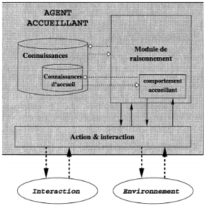

# Robot Ramasseurs De Balles
---

|               Fodé HISSIROU               |
---

## Introduction

### Systèmes multi-agents

-  systèmes multi-agent sont composés d’entités informatiques distribuées qui interagissent entre elles. 
Il détermine les règles permettant de concevoir des systèmes intelligence artificiel fondé sur des règles. 
Il s’intéresse aux comportements collectifs produits par des interactions de plusieurs entités autonomes et flexibles.
Ces entités peuvent opérer de façons collectives pour accomplir les tâches complexes. 
Malgré que les caractéristiques de modélisation dépendent de l’application, 
mais il y a bien certains caractéristiques qui sont commune aux agents : La coopération, la coordination et la communication.

### Un agent 

- C’est une entité autonome, réelle ou abstraite qui est capable d’agir sur elle-même et sur son environnement,
qui, dans un univers multi-agents, peut communiquer avec d’autres agents et dont le comportement est la conséquence de ses observations,
de ses connaissances et des interactions avec d’autres agents. 
Cependant, les agents peuvent être classés en deux catégories principales selon leur comportement et leur complexité de raisonnement afin de séparer les agents dites « intelligents »  des agents moins « intelligents ». 
On parle donc des agents cognitifs et agents réactifs
Concevoir le site Workfoce en tenant compte des aspects

------------
##### - Les agents cognitifs
- sont fondés sur la coopération d’agents capables à eux  seuls d’effectuer des opérations complexes. 
Un système cognitif comprend un petit nombre d’agents qui disposent d’une capacité de raisonnement sur une base de connaissances 
pour traiter les informations diverses liées au domaine d’applications.
Ces types d’agents peuvent être assimilés à des systèmes experts distribués.

##### - Un agent réactif 

- Evolue parmi un nombre important de ses semblables et c’est le résultat des interactions entre leur activité qui donne une impression de comportement global « intelligent ».
Ces agents de ne possèdent de représentations de leur environnement. 
De ce fait toutes les informations relatives à leur comportement se trouvent dans l’environnement et leurs réactions dépendant uniquement de la perception qu’ils peuvent en avoir.

## Présentation de l’outil Netlogo
- Un des outils largement utilisé pour la simulation des systèmes multi-agent est le logiciel Netlogo qui est un logiciel open source fourni sous la licence GPL.  
Il est à la fois un langage de programmation et un environnement de modélisation pour le développement des systèmes multi-agents.
De base, il été développé en Java par l’Université Northwestern pour des fins pédagogiques, 
et de nos jours Netlogo est beaucoup utilisé dans le milieu professionnel et cela est dû à la facilité d’utilisation 
qui permet de modéliser des phénomènes sans pour autant avoir des connaissances approfondie en programmation. 
Il particulièrement adapté à la modélisation de systèmes complexes sur un parcours de temps.
